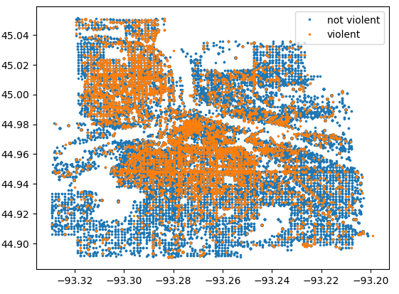
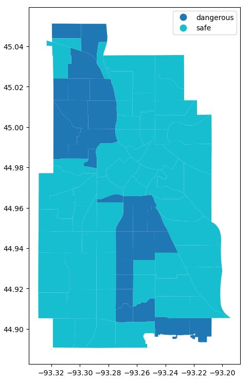

# Crime + Weather Data Integration (Twin Cities / Minneapolis)

This project builds an analysis-ready dataset by **cleaning and combining Minneapolis crime incident records (2017–2023)** across years with **geospatial layers** and **weather data**. The main focus is **data engineering + feature creation** to set up future modeling/visualization work.

> Current notebook focuses on **Minneapolis** (2017–2023).

---

## Project Objectives
- Standardize annual crime files that have **inconsistent schemas** across years (2017–2018 vs 2019–2023)
- Fix data quality issues (e.g., datetime formatting differences in 2018)
- Combine disparate sources (crime incidents + geospatial + weather) into a single dataset and create features for downstream analysis

---

## Exploratory Plots (from notebook)

### Example: where violent crimes happened (Twin Cities area)

### Derived feature: “dangerous” vs “not dangerous” areas
This plot visualizes the **engineered area-level classification** created in the notebook to label locations as relatively higher-risk (“dangerous”) vs lower-risk (“not dangerous”).

---

## Data Sources
The notebook uses the following sources:
1. **Minneapolis Police Incidents** (Open Data Portal): https://opendata.minneapolismn.gov/
2. **NOAA Local Climatological Data (LCD)** for weather: https://www.ncei.noaa.gov/products/land-based-station/local-climatological-data
3. **Hennepin County Police Stations** (ArcGIS Hub): https://gis-hennepin.hub.arcgis.com/datasets/hennepin::police-stations/explore

---

## What the Notebook Does
High-level pipeline (as implemented in `process_data_mpls.ipynb`):

1) **Load yearly incident files (2017–2023)** and normalize column names/structures  
2) **Clean and standardize timestamps** (notably 2018 formatting)  
3) **Assess data quality** and resolve cross-year inconsistencies  
4) **Scrape/ingest weather data** (LCD) for potential crime–weather analyses  
5) **Feature creation** to support future analysis  
6) **Load yearly geospatial crime files** (GeoJSON) and combine for mapping/spatial joins  

---

## Unified Schema (Target Columns)
After harmonizing across years, the notebook aims to produce a consistent structure including:
- case number (unique ID)
- public address
- reported datetime / begin datetime
- latitude / longitude
- precinct
- neighborhood
- offense code + description

---

## Repository Contents
- `process_data_mpls.ipynb` — main data processing + integration notebook
- `README.md` — project overview (this file)
- `plt1.png`, `plt2.png` — plots exported from the notebook and embedded above

> Note: The repository may reference local `data/` paths in the notebook; raw data files are typically not committed to GitHub.

---

## Future Work Ideas
- Build neighborhood-level time series (weekly/monthly) and study trends
- Explore relationships between **weather (temperature/precipitation)** and incident volume/type
- Add St. Paul data and unify a broader **Twin Cities** dataset
- Create interactive maps and dashboards (e.g., GeoPandas/folium/kepler.gl)

---

## Author
Mansoo Cho
